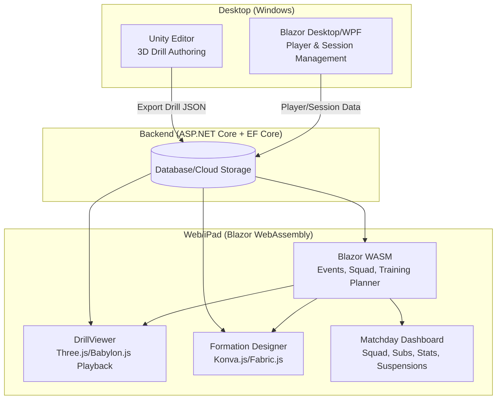
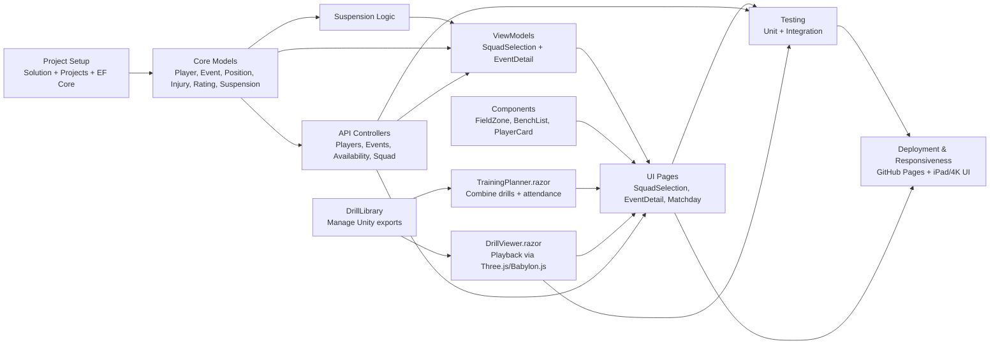
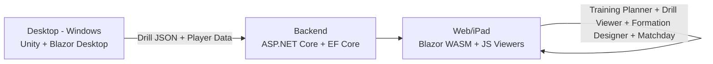
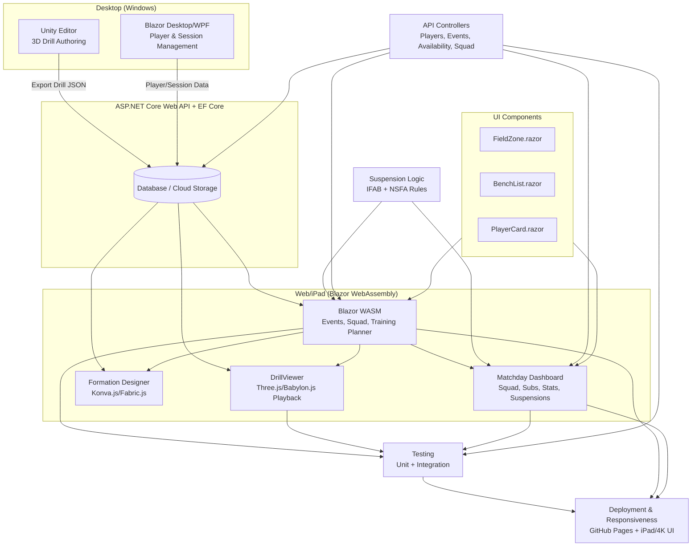
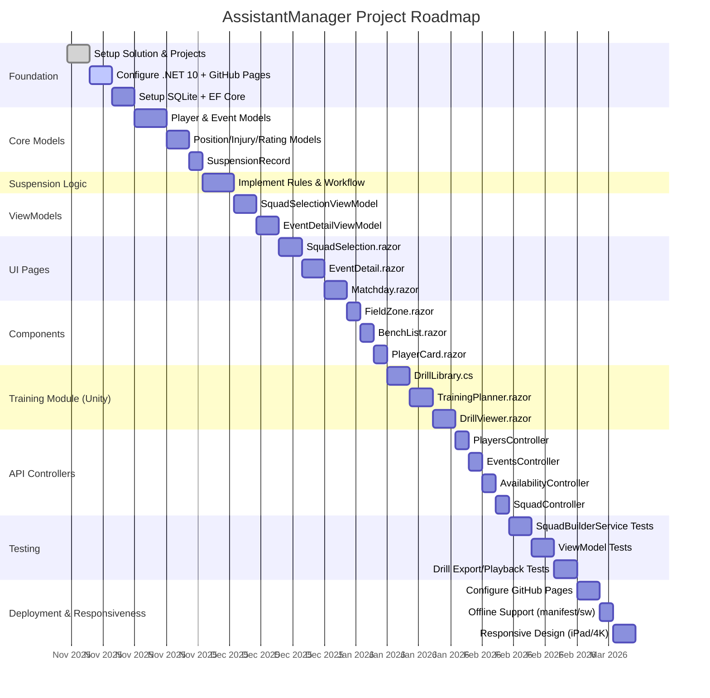

# Working file - where I'm up to

## Architectural Diagram

## Dependency Map

## Executive Summary diagram/map

## All-in-one diagram/map

---

## 🚀 AssistantManager Progress Tracker

### 🎯 Milestone 1 – Foundation

- [x] Create VS2026 solution `AssistantManager`
- [x] Add projects: Client (Blazor WASM), Server (ASP.NET Core Web API), Shared (class library)
- [ ] Configure for .NET 10 and GitHub Pages deployment
- [ ] Set up SQLite + EF Core

---

### 🎯 Milestone 2 – Core Domain Models

- [ ] Implement `Player` model (details, preferences, injuries, availability, ratings)
- [ ] Implement `Event` model (date, type, location, notes, availability)
- [ ] Implement `PositionPreference`, `InjuryRecord`, `CoachRating`
- [ ] Implement `SuspensionRecord`

---

### 🎯 Milestone 3 – Suspension Logic

- [ ] Build suspension rules (IFAB + NSFA compliance)
- [ ] Handle red cards, second yellows, accumulated yellows (5, 8, 11)
- [ ] Reset yellow count after season
- [ ] Carry over unserved suspensions
- [ ] Exclude suspended players unless `CoachOverride == true`

---

### 🎯 Milestone 4 – Client ViewModels

- [ ] Create `SquadSelectionViewModel` (drag/drop, auto-suggest)
- [ ] Create `EventDetailViewModel` (load, update, save availability)

---

### 🎯 Milestone 5 – UI Pages

- [ ] `SquadSelection.razor` (drag/drop squad builder)
- [ ] `EventDetail.razor` (event form + availability)
- [ ] `Matchday.razor` (squad, formation, subs, stats, suspensions — no drills)

---

### 🎯 Milestone 6 – Components

- [ ] `FieldZone.razor` (drop target, lockable)
- [ ] `BenchList.razor` (draggable unassigned players)
- [ ] `PlayerCard.razor` (compact info, suspension indicators)

---

### 🎯 Milestone 7 – Training Module (Unity Integration)

- [ ] `DrillLibrary.cs` (manage drill metadata, link Unity exports)
- [ ] `TrainingPlanner.razor` (combine drills into sessions, attendance, printable sheets)
- [ ] `DrillViewer.razor` (Three.js/Babylon.js playback of Unity JSON drills)

---

### 🎯 Milestone 8 – API Controllers

- [ ] `PlayersController` (CRUD)
- [ ] `EventsController` (CRUD)
- [ ] `AvailabilityController` (get/set availability)
- [ ] `SquadController` (suggest squad)

---

### 🎯 Milestone 9 – Testing

- [ ] Unit tests for `SquadBuilderService`
- [ ] Unit tests for `SquadSelectionViewModel` + `EventDetailViewModel`
- [ ] Tests for Unity drill export → JSON → playback pipeline

---

### 🎯 Milestone 10 – Deployment & Responsiveness

- [ ] Configure Blazor WASM for GitHub Pages deployment
- [ ] Add manifest.json + service worker for offline support
- [ ] Optimize UI for iPad Air (5th gen) and 4K desktop screens

---
